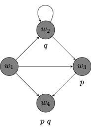

# modal propositional logic {.divider}

# basic language {.smaller}

Choose a stock of propositional variables or atoms:

$$
AT := p, q, r, \cdots
$$

We define the formulas of a propositional language $\mathcal{L}$ recursively:

$$
\varphi ::= AT \ | \ \neg \varphi \ | \ (\varphi \to \psi) \ | \Box \varphi
$$

- All atoms are formulas.

- If $\varphi$ is a formula, then $\neg \varphi$ is a formula.

- If $\varphi$ and $\psi$ are formulas, then $(\varphi \to \psi)$ is a formula.

- If $\varphi$ is a formula, then $\Box \varphi$ is a formula.

- Nothing else is a formula.

## some definitions 

::: {.definition}
$$
\begin{array}{lll}
\top & := & (p \to p)\\
\bot & := & \neg \top \\
(\varphi \vee \psi) & := & (\neg \varphi \to \psi)\\
(\varphi \wedge \psi) & := & \neg (\varphi \to \neg \psi)\\
(\varphi \leftrightarrow \psi) & := & (\varphi \to \psi) \wedge (\psi \to \varphi)\\
\Diamond \varphi & := & \neg \Box \neg \varphi\\
\end{array}
$$
:::

## induction on the complexity of formulas {.smaller}

Given a condition on formulas of $\mathcal{L}^\Box$, if

- all atoms meet the condition,

- a formula $\varphi$ meets the condition only if $\neg \varphi$ does,

- two formulas $\varphi$ and $\psi$ meet the condition only if $(\varphi \to \psi)$ does, and

- a formula $\varphi$ meets the condition only if $\Box \varphi$ does,

then all formulas of $\mathcal{L}$ meet the condition.

. . . 

## uniform substitution {.smaller}

::: {.definition}
Given a formula $\varphi$ with propositional variables $p_1, \dots, p_n$ and formulas $\psi_1, \dots, \psi_n$, we define 

 $$
\varphi[\psi_1/p_1, \dots, \psi_n/p_n]
 $$

by the recursion:

 $$
\begin{array}{lll}
p_i[\psi_1/p_1, \dots, \psi_n/p_n] & := & \psi_i \\
(\neg \chi) [\psi_1/p_1, \dots, \psi_n/p_n] & := & \neg \chi[\psi_1/p_1, \dots, \psi_n/p_n] \\
(\chi \to \rho)[\psi_1/p_1, \dots, \psi_n/p_n] & := & (\chi[\psi_1/p_1, \dots, \psi_n/p_n] \to \rho[\psi_1/p_1, \dots, \psi_n/p_n])\\
(\Box \chi) [\psi_1/p_1, \dots, \psi_n/p_n] & := & \Box \chi[\psi_1/p_1, \dots, \psi_n/p_n] \\
\end{array}
 $$
:::

# possible worlds semantics {.divider}

We develop a possible worlds semantics for $\mathcal{L}^\Box$.

# possible worlds models

::: {.definition}
A **possible worlds model** $M$ for $\mathcal{L}^\Box$ is a structure $(W, R, V)$ where:

1. $W$ is a non-empty set of worlds

2. $R$ is a binary accessibility relation on $W$

3. $V$ maps each propositional variable $p$ to a set of worlds $V(p) \subseteq W$.
:::

. . .

::: {style="height: 100px;"}
:::

::: {.callout-note}
$Ruv$ is sometimes written $uRv$ and read: "$v$ is accessible from $u$." To be accessible from $u$ is to be possible relative to $u$.

$V(p)$ is the set of worlds at which $p$ is true. So, $w \in V(p)$ is sometimes read: "$p$ is true at $w$."
:::

## graphs for possible worlds models {.smaller}

The directed graph below depicts a possible worlds model $(W, R, V)$ where:

::: {.columns}

::: {.column width="33%"}
- $W = \{w_1, w_2, w_3, w_4\}$

- $R = \{(w_1, w_2), (w_2, w_3), (w_3, w_4), (w_1, w_4), (w_1, w_3), (w_2, w_2)\}$

- $V$ is a valuation on which:
    - $V(p) = \{w_3, w_4\}$;
    - $V(q) = \{w_2, w_4\}$

:::

::: {.column width="67%"}

{width="350px" fig-align="center"}
:::
:::

## truth at a world

::: {.definition}
$\varphi$ is **true at a world** $w$ in a possible worlds model $M$, written $M, w \Vdash \varphi$: 

$$
\begin{array}{lll}
M, w \Vdash p & \text{iff} & w \in V(p)\\
M, w \Vdash \neg \varphi & \text{iff} & M, w \nVdash \varphi\\
M, w \Vdash (\varphi \to \psi) & \text{iff} & M, w \nVdash \varphi \ \text{or} \ M, w \Vdash \psi\\
M, w \Vdash \Box \varphi & \text{iff} & \text{for every} \ u \in W \ \text{such that} \ Rwu, \ M, u \Vdash \varphi\\
\end{array}
$$

Given the defintion of $\Diamond$ in terms of $\Box$, we find that $$
\begin{array}{lll}
M, w \Vdash \Diamond \varphi & \text{iff} & \text{for some} \ u \in W \ \text{such that} \ Rwu, \ M, u \Vdash \varphi\\
\end{array}
$$
:::

## example

::: {.example-panel}
Evaluate each formula at each possible world in the model:

::: {.columns}
::: {.column width="33%"}
- $p \to (p \to q)$

    True at $w_1$, $w_2$ and $w_3$

- $\Box p$
    
    True at $w_3$ and $w_4$
    
- $\Diamond \Box p$

    True at $w_1$, $w_2$ and $w_3$    
::: 

::: {.column width="67%"}

{width="300px" fig-align="center"}
:::

:::
:::

## truth in a model

::: {.definition}
A formula $\varphi$ to be **true in a possible worlds model** $M$, which we write $M \Vdash \varphi$ if, and only if, for all $w\in W$, $M, w \Vdash \varphi$
:::

## example

::: {.example-panel}
Evaluate each formula in the model:

::: {.columns}
::: {.column width="33%"}
- $\neg p \to \Diamond q$

    True in the model.

- $p \to \Box p$
    
    True in the model.

- $\Box \Diamond p$

    Not true in the model    
::: 

::: {.column width="67%"}
{width="300px" fig-align="center"}
:::

:::
:::

# frames

::: {.definition}
A **frame** $F$ for $\mathcal{L}^\Box$ is an ordered pair $(W, R)$ where:

- $W$ is a non-empty set of worlds, and

- $R$ is a binary accessibility relation on $W$

A model $M$ is **based on a frame** $F = (W, R)$ if, and only if, there is an assignment $V$ such that $M = (F, V)$. That is, $M = (W, R, V)$.
:::

## validity

::: {.definition}
A formula $\varphi$ is **valid in a frame** $(W, R)$, written $(W, R) \models \varphi$, if, and only if, $\varphi$ is true in every model $(W, R, V)$ based on the frame $(W, R)$.

That is, the formula remains true across assignments no matter what sets of worlds we assign to what propositional variables.

A formula $\varphi$ is **valid**, written $\models \varphi$, if, and only if, $\varphi$ is valid in every frame $(W, R)$.
:::

## example

::: {.example-panel}
::: {.columns}
::: {.column width="50%"}
Two **valid** formulas:

1. $\Diamond (p \vee q) \leftrightarrow (\Diamond p \vee \Diamond q)$

2. $\Box (p \wedge q) \leftrightarrow (\Box p \wedge \Box q)$
:::
::: {.column width="50%"}
Two **invalid** formulas:

3. $\Diamond (p \wedge q) \leftrightarrow (\Diamond p \wedge \Diamond q)$

4. $\Box (p \vee q) \leftrightarrow (\Box p \vee \Box q)$
:::
:::
:::

## validity in a class of frames

::: {.definition}
A formula $\varphi$ is **valid in a class of frames** $\mathcal{C}$, written $\models_{\mathcal{C}} \varphi$ if, and only if, $\varphi$ is valid in every frame $(W, R)$ in the class $\mathcal{C}$.
:::
For example:

- $\Box p \to p$ is valid in the class of *reflexive* frames.

- $p \to \Box \Diamond p$ is valid in the class of *symmetric* frames.

- $\Box p \to \Box \Box p$ is valid in the class of *transitive* frames.

## example

::: {.example-panel}

|              |             Formula              |  Condition on $R$   |
|:------------:|:--------------------------------:|:-------------------:|
| $\textsf{T}$ |          $\Box p \to p$          | *reflexive on* $W$  |
| $\textsf{B}$ |     $p \to \Box \Diamond p$      | *symmetric on* $W$  |
| $\textsf{4}$ |     $\Box p \to \Box \Box p$     | *transitive on* $W$ |
| $\textsf{5}$ | $\Diamond p \to \Box \Diamond p$ | *euclidean on* $W$  |

:::
