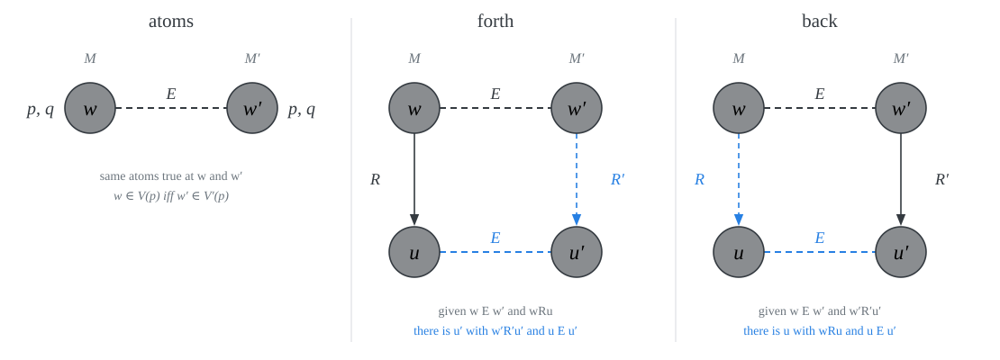
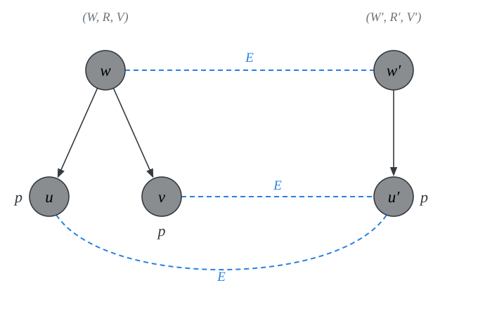
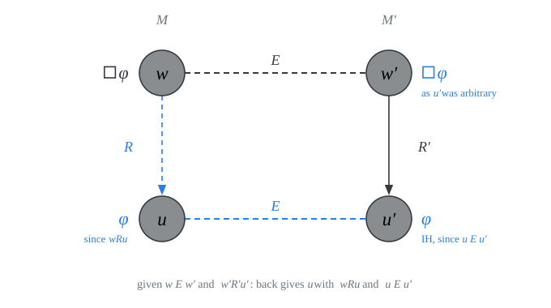
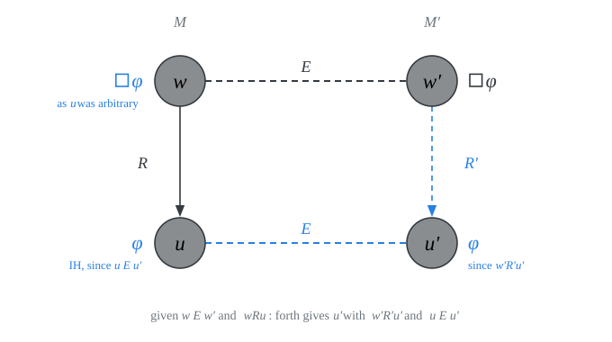
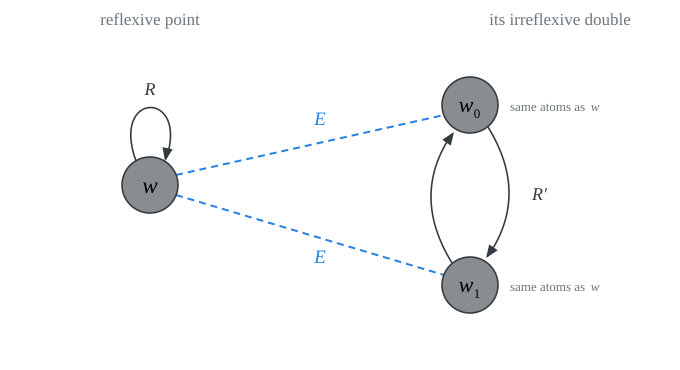
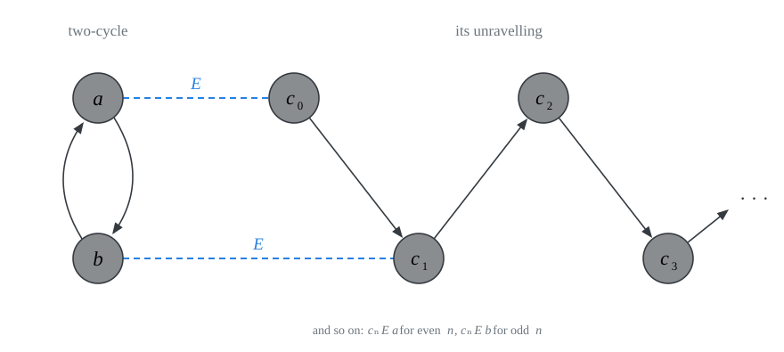

# bisimulation {.divider}

Bisimulations are to modal propositional logic what isomorphisms are to first-order logic:

::: {.incremental}
- two isomorphic models verify exactly the same first-order formulas.
- two bisimilar possible worlds models verify the same modal formulas
:::

## definition {.smaller}

A *bisimulation* between $(W, R, V)$ and $(W', R', V')$ is a relation $E \subseteq W \times W'$ where for all $w \in W$, for all $w'\in W'$, if $wEw'$, then:

::: {.incremental}
1. $w \in V(p)$ iff $w' \in V'(p)$, for all propositional atoms $p$ (atoms);
2. if $wRu$, then for some $u' \in W'$, $w'R'u'$ and $uEu'$  (forth);
3. if $w'R'u'$, then for some $u \in W$, $wRu$ and $uEu'$  (back).
:::
. . . 

{.nostretch width="90%" fig-align="center"}

## example: a bisimulation {.smaller}

::: {.columns}
::: {.column width="44%"}
- $W = \{w, u, v\}$; $R = \{(w, u), (w, v)\}$; $V(p) = \{u, v\}$

::: {style="height: 5px;"}
:::

- $W' = \{w', u'\}$; $R' = \{(w', u')\}$; $V'(p) = \{u'\}$

::: {style="height: 5px;"}
:::

- $E = \{(w, w'), (u, u'), (v, u')\}$

::: {style="height: 5px;"}
:::
$E$ is a bisimulation between $(W, R, V)$ and $(W', R', V')$:

::: {.incremental}
- **atoms:** 
  - $w$ and $w'$ verify no propositional atoms. 
  - $u$, $v$ and $u'$ verify just $p$.
  
- **forth:** 
  
  - since $wRu$ and $wRv$, we have $w'R'u'$ with $uEu'$ and $vEu'$. 
  - $u$ and $v$ see nothing.
  
- **back:** 

  - since $w'R'u'$, we have $wRu$ with $uEu'$. 
  - $u'$ sees nothing.
:::
:::

::: {.column width="56%"}
{width="100%"}
:::
:::

## invariance lemma {.smaller}
::: {#prp-inv}
If there is a bisimulation $E$ between two models $(W, R, V)$ and $(W', R', V')$, then for all $w\in W$, for all $w'\in W'$, if $wEw'$, then for each modal formula $\varphi$ of $\mathcal{L}^\Box$:
$$\begin{array}{lll}
(W, R, V), w \Vdash \varphi & \text{iff} &  (W', R', V'), w' \Vdash \varphi.
\end{array}$$
:::

::: {.proof}
::: {.incremental}
By induction on the complexity of formulas. We use the condition:

  - For all $w\in W$, for all $w'\in W'$, if $wEw'$:
      $$
      \begin{array}{lll}
      (W, R, V), w \Vdash \varphi & \text{iff} &  (W', R', V'), w' \Vdash \varphi.
      \end{array}
      $$
:::
:::

## base and Boolean cases {.smaller}

Assume $wEw'$.

- **base case**, $\varphi = p$:
$$
\begin{array}{llll}
M, w \Vdash p & \text{iff} & w \in V(p) & \\
 & \text{iff} & w' \in V'(p) & \textsf{atoms}\\
 & \text{iff} & M', w' \Vdash p &
\end{array}
$$

- **inductive step for** $\neg$:
$$
\begin{array}{llll}
M, w \Vdash \neg\varphi & \text{iff} & M, w \nVdash \varphi & \\
 & \text{iff} & M', w' \nVdash \varphi & \textsf{inductive hypothesis}\\
 & \text{iff} & M', w' \Vdash \neg\varphi &
\end{array}
$$

- **inductive step for** $\to$:
$$
\begin{array}{llll}
M, w \Vdash \varphi \to \psi & \text{iff} & M, w \nVdash \varphi \ \text{or} \ M, w \Vdash \psi & \\
 & \text{iff} & M', w' \nVdash \varphi \ \text{or} \ M', w' \Vdash \psi & \textsf{inductive hypothesis}\\
 & \text{iff} & M', w' \Vdash \varphi \to \psi &
\end{array}
$$

## inductive step for $\Box$: ($\Rightarrow$) {.smaller}

::: {.columns}
::: {.column width="44%"}
Assume $wEw'$ and $M, w \Vdash \Box\varphi$. Let $w'R'u'$.

::: {.incremental}
- By $\textsf{back}$, for some $u \in W$, $wRu$ and $uEu'$.
- Since $M, w \Vdash \Box\varphi$ and $wRu$: $M, u \Vdash \varphi$.
- Since $uEu'$, by inductive hypothesis: $M', u' \Vdash \varphi$.
- $u'$ was arbitrary, so $M', w' \Vdash \Box\varphi$.
:::
:::

::: {.column width="56%"}
{width="100%"}
:::
:::

## inductive step for $\Box$: ($\Leftarrow$) {.smaller}

::: {.columns}
::: {.column width="44%"}
Suppose $wEw'$ and $M', w' \Vdash \Box\varphi$. Let $wRu$.

::: {.incremental}
- By $\textsf{forth}$, for some $u' \in W'$, $w'R'u'$ and $uEu'$.
- Since $M', w' \Vdash \Box\varphi$ and $w'R'u'$: $M', u' \Vdash \varphi$.
- Since $uEu'$, by inductive hypothesis: $M, u \Vdash \varphi$.
- $u$ was arbitrary, so $M, w \Vdash \Box\varphi$. 
:::
:::

::: {.column width="56%"}
{width="100%"}
:::
:::

## Every model is bisimilar to some irreflexive model {.smaller}

::: {.columns}
::: {.column width="52%"}
Given a model $M = (W, R, V)$, we let $M' = (W', R', V')$ where

- $W' = W \times \{0, 1\}$; We write $w_i$ for $(w, i)$.
- $w_i R' u_i$ \ iff \ $wRu$ and $i \neq j$;
- $w_i \in V'(p)$ \ iff \ $w \in V(p)$.

$R'$ is *irreflexive*, since $i \neq i$ is never the case.

$E = \{(w, w_i) : w \in W,\ i \in \{0, 1\}\}$ is a bisimulation between the two models:

::: {.incremental}
- **atoms:** 
    - trivial by the definition of $V'$.
- **forth:** 
    - if $wEw_i$ and $wRu$, then $w_i R' u_{1-i}$ and $uEu_{1-i}$.
- **back:** 
    - if $wE w_i$ and $w_i R' u_j$, then $wRu$ and $uE u_j$.
:::
:::

::: {.column width="48%"}
{width="100%"}

The simplest case: a reflexive point and its double, a two-cycle.
:::
:::

## Irreflexivity is not modally definable {.smaller}

::: {#prp-irr}
No formula $\varphi$ is valid in all and only irreflexive frames.
:::

::: {.proof}
Suppose $\varphi$ is valid in all and only the irreflexive frames.

::: {.incremental}
- The frame $(\{w\}, \{(w, w)\})$ is not irreflexive. So, by assumption, for some $V$, $(\{w\}, \{(w, w)\}, V), w \nVdash \varphi$.
- Its two-cycle counterpart is irreflexive. So, by assumption, $\varphi$ is valid in that frame, which means that $(W', R', V'), w_0 \Vdash \varphi$.
- But notice that $wE w_0$ in the given bisimulation $E$.
- So, by Invariance, $(\{w\}, \{(w, w)\}, V), w \Vdash \varphi$. Contradiction.
:::
:::

## The recipe, and more corollaries {.smaller}

::: {.columns}
::: {.column width="50%"}
To show that a structural condition $C$ is not modally definable, find a frame $G$ in which $C$ fails such that 

- for each model $M$ based on $G$ and each world $w$ in $M$, there is a model $N$ based on some frame $F$ that satisfies $C$ and a world $u$ in $N$, and a bisimulation $E$ between $M$ and $N$ with $wEv$.

| condition $C$ | $G$ lacks $C$ | $F$ has $C$ |
|:----|:-------------|:-------------|
| irreflexive | reflexive point | two-cycle |
| asymmetric | reflexive point | $(\mathbb{N}, S)$ |
| intransitive | reflexive point | $(\mathbb{N}, S)$ |
| infinite | reflexive point | $(\mathbb{N}, S)$ |
| antisymmetric | two-cycle | $(\mathbb{N}, S)$ |

In the infinite chain $(\mathbb{N}, S)$:

- $S = \{(n,m): m = n+1\}$
:::

::: {.column width="50%"}
{width="100%"}

Given a model $(\{a, b\}, \{(a, b), (b, a)\}, V)$, consider a model based on $(\mathbb{N}, S)$ where for each atom $p$:

$$
V'(p) = \{n \in \mathbb{N}: (a \in V(p) \ \text{and} \ n \ \text{even}) \ \text{or} \ (n \in V(p) \ \text{and} \ n \ \text{odd}) \}
$$
$E = \{(a, n): n \ \text{even}\} \cup \{(b, n): n \ \text{odd}\}$
:::
:::

