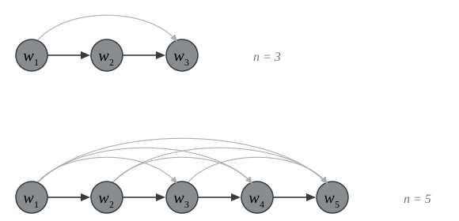
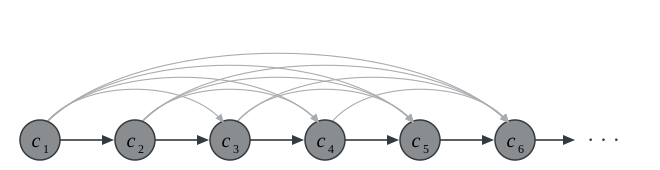
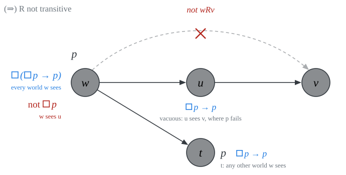
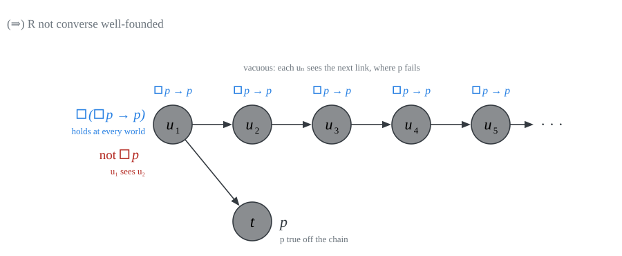
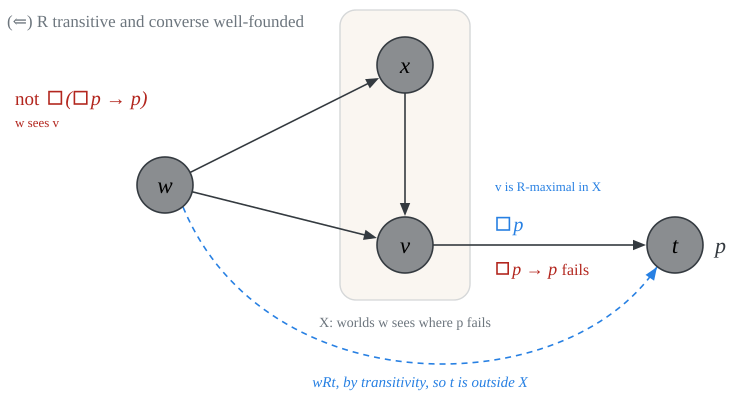

# frame definability {.divider}

What emerged from our discussion of frames is that different classes of frames are characterized by distinctive formulas of modal propositional logic.

## modal definability

::: {.definition}
A formula $\varphi$ of $\mathcal{L}^\Box$ *modally defines* a class of frames $\mathcal{C}$ iff for all frames $(W, R)$,

$$\begin{array}{lll}
(W, R) \models \varphi & \text{iff} &  (W, R) \in \mathcal{C}
\end{array}$$
:::

::: {.incremental}
- $\textsf{T}$ modally defines the class of *reflexive* frames

- $\textsf{B}$ modally defines the class of *symmetric* frames

- $\textsf{4}$ modally defines the class of *transitive* frames

- $\textsf{5}$ modally defines the class of *euclidean* frames
:::

## first-order definability

Let $\mathcal{L}$ be a first-order language with a binary predicate $R$ as part of the non-logical vocabulary.

::: {.definition}
A formula $\varphi$ of first-order $\mathcal{L}$ *first-order defines* a class of frames $\mathcal{C}$ iff for all frames $(W, R)$,

$$\begin{array}{lll}
(W, R) \models \varphi & \text{iff} &  (W, R) \in \mathcal{C}
\end{array}$$
:::

::: {.incremental}
- $\forall x Rxx$ first-order defines the class of *reflexive* frames

- $\forall x \forall y (Rxy \to Ryx)$ first-order defines the class of *symmetric* frames

- $\forall x \forall y \forall z (Rxy \wedge Ryz \to Rxz)$ first-order defines the class of *transitive* frames

- $\forall x \forall y \forall z (Rxy \wedge Rxz \to Ryz)$ first-order  defines the class of *euclidean* frames
:::

## are all first-order definable classes of frames modally definable?

The answer is **no**. Some negative results:

::: {style="height: 50px;"}
:::

::: {.incremental}
- $\forall x \ \neg Rxx$ *first-order defines* the class of *irreflexive* frames.

- no formula of $\mathcal{L}^\Box$ *modally defines* the class of *irreflexive* frames.

::: {style="height: 50px;"}
:::

- $\forall x \ Rxx$ *first-order defines* the class of *universal* frames.

- no formula of $\mathcal{L}^\Box$ *modally defines* the class of *universal* frames.
:::

## are all modally definable classes of frames first-order definable?

The answer is still *no*. Some negative results:

::: {style="height: 50px;"}
:::

::: {.incremental}
- $\Box (\Box p \to p) \to \Box p$ *modally defines* the class of *transitive converse well-founded* frames.

- *no first-order formula* defines the class of *transitive converse well-founded* frames.

::: {style="height: 50px;"}
:::

- $\Box (\Box (p \to \Box p) \to p) \to p$ *modally defines* the class of frames that are *partial orders with no infinite strictly ascending $R$-chains*.

- *no first-order formula* defines the class of frames that are *partial orders with no infinite strictly ascending $R$-chains*.
:::

## example: transitive converse well-founded frames {.smaller}

::: {#prp-cwf}
No first-order formula $\psi$ is true in all and only the transitive converse well-founded frames.
:::

::: {.definition}
A relation $R$ on a set $W$ *converse well-founded* iff there are no infinite ascending $R$-chains of the form $x_1Rx_2 \cdots x_nRx_{n+1} \cdots$.
:::

This is a consequence of Compactness: if a set of first-order formulas $\Gamma$ is finitely satisfiable, then $\Gamma$ is satisfiable.

::: {.proof}
Suppose, for contradiction, that $\psi$ is true in *all and only* the transitive converse well-founded frames, whatever we assign to new constants.

- Let $\Sigma$ be a set of first-order formulas that require $R$ to be transitive.

- Add new constants $c_1, c_2, c_3, \dots$ and let
$$
\Gamma_0 := \{Rc_ic_{i+1} : i \geq 1\}.
$$

- **Claim.** $\Sigma \cup \Gamma_0 \cup \{\psi\}$ is finitely satisfiable.
:::

## step 1: finite satisfiability {.smaller}

::: {.columns}
::: {.column width="45%"}
Let $\Delta$ be a finite subset of $\Sigma \cup \Gamma_0 \cup \{\psi\}$.

- Let $n$ be the largest index of a $c_i$ in $\Delta$ (or $1$ if there is none).

- Let $W = \{w_1, \dots, w_n\}$, let $R$ be the transitive closure of a strict order $w_1 R w_2 R \cdots R w_n$, and interpret $c_i$ as $w_i$.

- $(W, R)$ is transitive and converse well-founded

- By assumption, $(W, R) \models \psi$.

- $(W, R)$ satisfies $\Sigma$ and every $Rc_ic_{i+1}$ in $\Delta$.

So, $\Delta$ is satisfiable.
:::

::: {.column width="55%"}
{width="620px"}
:::
:::

## step 2: compactness {.smaller}

By Compactness, $\Sigma \cup \Gamma_0 \cup \{\psi\}$ has a model $(W, R)$:

{.nostretch width="70%" fig-align="center"}

::: {.incremental}
- $R$ is transitive and $(W, R) \models \psi$.

- $c_1 R c_2 R c_3 R \cdots$ is now an *infinite* ascending $R$-chain.

- $(W, R)$ is *not* converse well-founded.

- But $\psi$ is true *only* in converse well-founded frames. Contradiction.
:::

::: {.fragment}
We conclude that the class of transitive converse well-founded frames is not first-order definable. $\blacksquare$
:::

## transitive converse well-founded frames are modally definable {.smaller}

::: {#prp-lob}
For every frame $(W, R)$:

$$
(W, R) \models \Box(\Box p \to p) \to \Box p
\quad\text{iff}\quad
R \text{ is transitive and converse well-founded on } W.
$$
:::

::: {style="height: 50px;"}
:::

::: {.proof}
We proceed in two stages:

::: {.incremental}
- ($\Rightarrow$) We target the contrapositive. 
        
    If $R$ is *not transitive*, or *not converse well-founded*, then we will find a valuation $V$ and a world where Löb fails.

- ($\Leftarrow$) If $R$ is transitive and converse well-founded, then, given a valuation $V$, we will find that a world will falsify $\Box p$ only if it falsifies $\Box(\Box p \to p)$.
:::
:::

## ($\Rightarrow$) $R$ not transitive {.smaller}

::: {.columns}
::: {.column width="40%"}
Suppose $wRu$ and $uRv$ but not $wRv$. Let $V(p) = W \setminus \{u, v\}$.

- $w \nVdash \Box p$, since $wRu$ and $u \notin V(p)$.

- $u \nVdash \Box p$, since $uRv$ and $v \notin V(p)$. So $u \Vdash \Box p \to p$.

- If $wRt$, then $t = u$ or $t \in V(p)$ (as $t \neq v$). Either way, $t \Vdash \Box p \to p$.

- So $w \Vdash \Box(\Box p \to p)$ but $w \nVdash \Box p$.
:::

::: {.column width="60%"}
{width="100%"}
:::
:::

## ($\Rightarrow$) $R$ not converse well-founded {.smaller}

Suppose $u_1 R u_2 R u_3 R \cdots$ is an infinite ascending chain. Let $V(p) = W \setminus \{u_1, u_2, \dots\}$.

{.nostretch width="72%" fig-align="center"}

::: {.incremental}
- Each $u_n$ sees $u_{n+1} \notin V(p)$, so $u_n \nVdash \Box p$ and $u_n \Vdash \Box p \to p$. All worlds off the chain satisfy $p$. So $\Box p \to p$ is true at all worlds.

- Hence $u_1 \Vdash \Box(\Box p \to p)$, but $u_1 \nVdash \Box p$.
:::

## ($\Leftarrow$) $R$ transitive and converse well-founded {.smaller}

::: {.columns}
::: {.column width="42%"}
Fix $V$ and $w$, and suppose $w \nVdash \Box p$. Let
$$
X = \{u \in W : wRu \text{ and } u \notin V(p)\} \neq \varnothing.
$$

- Since $R$ is converse well-founded, $X$ has an $R$-maximal $v$: no $t \in X$ with $vRt$.

- $v \nVdash p$, since $v \in X$.

- If $vRt$, then $wRt$ by transitivity, and $t \notin X$, so $t \Vdash p$. Thus $v \Vdash \Box p$.

- So $v \nVdash \Box p \to p$. As $wRv$, $w \nVdash \Box(\Box p \to p)$. $\blacksquare$
:::

::: {.column width="58%"}
{width="100%"}
:::
:::

