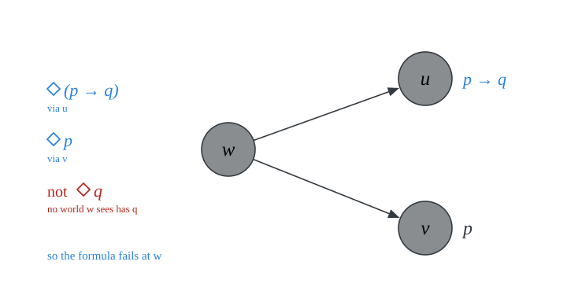
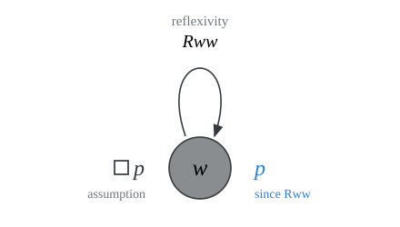
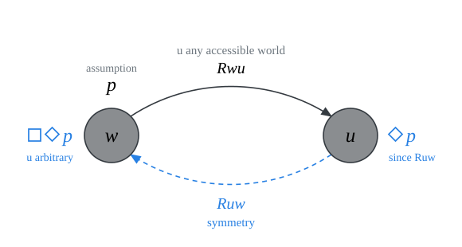
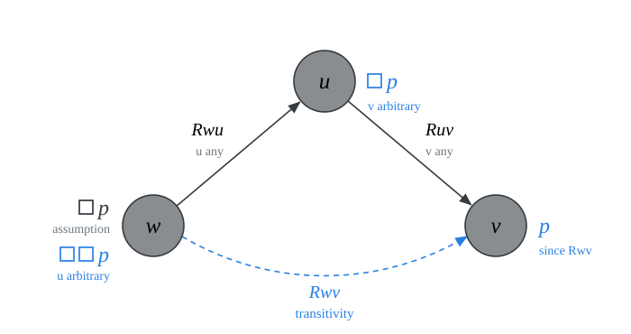
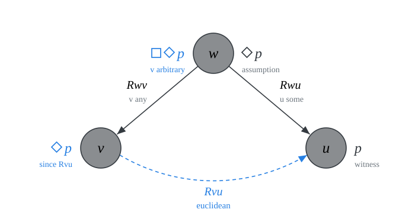

# frame validity {.divider}

One reason to explore frames is the correspondence between the validity of certain modal principles and structural conditions on accessibility.

# frames 

::: {.definition}
A **frame** $F$ for $\mathcal{L}^\Box$ is an ordered pair $(W, R)$ where:

- $W$ is a non-empty set of worlds, and

- $R$ is a binary accessibility relation on $W$

A model $M$ is **based on a frame** $F = (W, R)$ iff $M = (F, V)$ for some assignment $V$. 

That is,  $M$ is based on $(W, R)$ iff $M = (W, R, V)$.
:::

## validity

::: {.definition}
A formula $\varphi$ is **valid in a frame** $(W, R)$, written $(W, R) \models \varphi$, iff $\varphi$ is true in every model $(W, R, V)$ based on the frame $(W, R)$.

That is, the formula remains true across models based on that frame: it is true no matter what sets of worlds we assign to the propositional variables.

A formula $\varphi$ is **valid**, written $\models \varphi$, iff $\varphi$ is valid in every frame $(W, R)$.
:::

## example {.smaller}

::: {#prp-val0}
The formula $\Box (p \to q) \to (\Box p \to \Box q)$ is valid in every frame.
:::

::: {.proof}
Fix a frame $(W, R)$. $\Box (p \to q) \to (\Box p \to \Box q)$ is true in every model $M$ based on that frame. 

Fix a valuation $V$. $\Box (p \to q) \to (\Box p \to \Box q)$ is true in $M = (W, R, V)$. 

Fix a world $w$ in $W$. $\Box (p \to q) \to (\Box p \to \Box q)$ is true at $w$ in $M$.

Assume $M, w \Vdash \Box (p \to q)$. We now argue that $M, w \Vdash \Box p \to \Box q$. Assume $M, w \Vdash \Box p$, and let $u \in W$ be accessible from $w$. Then $M, u \Vdash p \to q$ and $M, u \Vdash p$. So, $M, u \Vdash q$. Generalizing, $M, w \Vdash \Box q$ as required.
:::

## example {.smaller}

::: {#prp-val0}
The formula $\Diamond (p \to q) \to (\Diamond p \to \Diamond q)$ is *not* valid in every frame.
:::

::: {.columns}
::: {.column width="58%"}
::: {.proof}
Consider a frame $(W, R)$ where:

- $W = \{w, u, v\}$
- $R = \{(w, u), (w, v)\}$

Consider a valuation $V$ such that $V(p) = \{v\}$ and $V(q) = \emptyset$.

Let $M$ be $(W, R, V)$. Then:

- $M, w \Vdash \Diamond (p \to q)$, since $Rwu$ and $M, u \Vdash p \to q$.
- $M, w \Vdash \Diamond p$, since $Rwv$ and  $M, v \Vdash q$.
- $M, w \nVdash \Diamond p$, since no world accessible from $w$ verifies $q$.
:::
:::
::: {.column width="42%"}

::: {style="height: 50px;"}
:::

{width="100%"}
:::
:::

## validity in a class of models

::: {.definition}
A formula $\varphi$ is **valid in a class of frames** $\mathcal{C}$, written $\models_{\mathcal{C}} \varphi$ if, and only if, $\varphi$ is valid in every frame $(W, R)$ in the class $\mathcal{C}$. 
:::

Some important classes of frames:

$$
\begin{array}{lll}
\mathcal{C}_{\textsf{ref}} & = & \{(W, R): R \ \text{is reflexive on} \ W\}\\
\mathcal{C}_{\textsf{sym}} & = & \{(W, R): R \ \text{is symmetric on} \ W\}\\
\mathcal{C}_{\textsf{trans}} & = & \{(W, R): R \ \text{is transitive on} \ W\}\\
\mathcal{C}_{\textsf{euc}} & = & \{(W, R): R \ \text{is euclidean on} \ W\}\\
\end{array}
$$

## example

::: {#prp-val}
Each formula is valid in a frame *if* $R$ satisfies the relevant condition.

|              |             Formula              |  Condition on $R$   |
|:------------:|:--------------------------------:|:-------------------:|
| $\textsf{T}$ |          $\Box p \to p$          | reflexive on $W$  |
| $\textsf{B}$ |     $p \to \Box \Diamond p$      | symmetric on $W$  |
| $\textsf{4}$ |     $\Box p \to \Box \Box p$     | transitive on $W$ |
| $\textsf{5}$ | $\Diamond p \to \Box \Diamond p$ | euclidean on $W$  |

:::

## $\textsf{T}$ is valid in reflexive frames {.smaller}

::: {#prp-valT}
$\textsf{T}$ is valid in all reflexive frames.
:::

::: {.columns}
::: {.column width="58%"}
::: {.proof}
Fix a *reflexive* frame $(W, R)$. 

Argue $\Box p \to p$ is true in every model $M$ based on that frame. 

Fix a valuation $V$. Argue $\Box p \to p$ is true in $M = (W, R, V)$. 

Fix a world $w$ in $W$. Argue $\Box p \to p$ is true at $w$ in $M$.

Assume $M, w \Vdash \Box p$. Since $R$ is reflexive, $Rww$, which means that $M, w \Vdash p$.
:::
:::
::: {.column width="42%"}
{width="100%"}
:::
:::

## $\textsf{B}$ is valid in symmetric frames {.smaller}

::: {#prp-valT}
$\textsf{B}$ is valid in all symmetric frames.
:::

::: {.columns}
::: {.column width="58%"}
::: {.proof}
Fix a *symmetric* frame $(W, R)$.

Argue $p \to \Box \Diamond p$ is true in every model $M$ based on that frame. 

Fix a valuation $V$. Argue $p \to \Box \Diamond p$ is true in $M = (W, R, V)$. 

Fix a world $w$ in $W$. Argue $p \to \Box \Diamond p$ is true at $w$ in $M$.

Assume $M, w \Vdash p$. Argue that $M, w \Vdash \Box \Diamond p$. If $w$ sees $u$, by symmetry, $Ruw$. So, $M, u \Vdash \Diamond p$. Generalizing, $M, w \Vdash \Box \Diamond p$.
:::
:::
::: {.column width="42%"}
{width="100%"}
:::
:::

## $\textsf{4}$ is valid in transitive frames  {.smaller}

::: {#prp-valT}
$\textsf{4}$ is valid in all transitive frames.
:::

::: {.columns}
::: {.column width="58%"}
::: {.proof}
Fix a *transitive* frame $(W, R)$. 

Argue $\Box p \to \Box \Box p$ is true in every model $M$ based on that frame. 

Fix a valuation $V$. Argue $\Box p \to \Box \Box p$ is true in $M = (W, R, V)$. 

Fix a world $w$ in $W$. Argue $\Box p \to \Box \Box p$ is true at $w$ in $M$.

Assume $M, w \Vdash \Box p$. If $w$ sees $u$, then $M, u \Vdash \Box p$. For if $u$ sees $v$, then since, by transitivity, $w$ sees $v$, $M, v \Vdash p$. Generalizing, $M, w \Vdash \Box \Box p$.
:::
:::
::: {.column width="42%"}
{width="100%"}
:::
:::

## $\textsf{5}$ is valid in euclidean frames  {.smaller}

::: {#prp-valT}
$\textsf{4}$ is valid in all euclidean frames.
:::

::: {.columns}
::: {.column width="58%"}
::: {.proof}
Fix a *euclidean* frame $(W, R)$. 

Argue $\Diamond p \to \Box \Diamond p$ is true in every model $M$ based on that frame. 

Fix a valuation $V$. Argue $\Diamond p \to \Box \Diamond p$ is true in $M = (W, R, V)$. 

Fix a world $w$ in $W$. Argue $\Diamond p \to \Box \Diamond p$ is true at $w$ in $M$.

Assume $M, w \Vdash \Diamond p$. That is, $w$ sees a world $u$ such that $M, u \Vdash p$. If $w$ sees a world $v$, then, since $R$ is euclidean and $Rwv$ and $Rwu$, we have $Rvu$. Therefore, $M, v \Vdash \Diamond p$. Generalizing, $M, v \Vdash \Box \Diamond p$.
:::
:::
::: {.column width="42%"}
{width="100%"}
:::
:::

# frame definability {.divider}

The success of the possible worlds framework is connected to the existence of systematic correspondences between the validity of certain modal principles and certain structural constraints on accessibility.

## modal correspondence

::: {#prp-val}
Each formula is valid in a frame *only if* $R$ satisfies the relevant condition.

|              |             Formula              |  Condition on $R$   |
|:------------:|:--------------------------------:|:-------------------:|
| $\textsf{T}$ |          $\Box p \to p$          | reflexive on $W$  |
| $\textsf{B}$ |     $p \to \Box \Diamond p$      | symmetric on $W$  |
| $\textsf{4}$ |     $\Box p \to \Box \Box p$     | transitive on $W$ |
| $\textsf{5}$ | $\Diamond p \to \Box \Diamond p$ | euclidean on $W$  |

:::

## $\textsf{T}$ is **only** valid in reflexive frames {.smaller}

::: {#prp-valT}
$\textsf{T}$ is only valid in all reflexive frames.
:::

::: {.columns}
::: {.column width="50%"}
::: {.proof}
If $(W, R) \models \textsf{T}$, then $R$ is reflexive on $W$.

Let $(W, R)$ be a frame such that $(W, R) \models \Box p \to p$.

$R$ is reflexive on $W$. Fix a world $w \in W$. Argue that $Rww$.

Let $V$ be such that $V(p) = \{u\in W: Rwu\}$. 

If $(W, R) \models \Box p \to p$, then $M = (W, R, V) \Vdash \Box p \to p$. Therefore, $M, w \Vdash \Box p \to p$. 

By construction, $M, w \Vdash \Box p$. Therefore, $M, w \Vdash p$. It follows that $w \in V(p) = \{u\in W: Rwu\}$ and $Rww$.
:::
:::
::: {.column width="50%"}
::: {.proof}
If $R$ is not reflexive on $W$, then $(W, R) \not \models \textsf{T}$

Fix a *non-reflexive* frame $(W, R)$.

$\Box p \to p$ is *not* true in every model $M$ based on that frame. 

Let $V$ be such that $V(p) = W \setminus \{w\}$, where $\neg Rww$.

$\Box p \to p$ is *not* true in $M = (W, R, V)$. 

$\Box p \to p$ is *not* true at $w$ in $M$.

- $M, w \Vdash \Box p$, since $p$ is true at all other worlds.

- $M, w \nVdash p$, since $w \notin V(p)$.
:::
:::
:::

