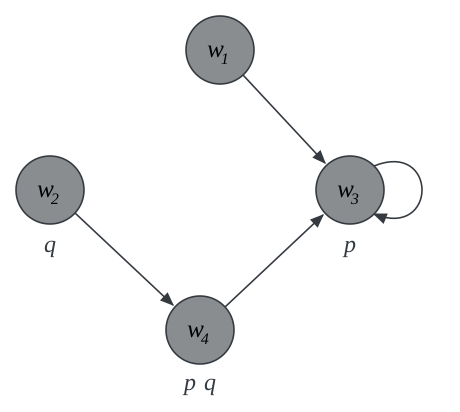

# why modal logic?

## modes of truth

In logic, we make a distinction between *true* and *false* propositions.

. . .

Modal logic makes further distinctions between different *ways* in which propositions may be true or false.

- *necessarily* true or *possibly* true
- *necessarily* false or *possibly* false.

. . .

We expand the language of propositional logic with a *propositional operator* $\Box$ for necessity, and a *dual*
operator $\Diamond$ for possibility.

## one formalism, different interpretations

| modality | $\Box$ | $\Diamond$ |
|----------|--------|------------|
| alethic | necessarily | possibly |
| temporal | always | sometimes |
| epistemic | it is known | for all it is known |
| deontic | obligatory | permitted |

. . .

One formal framework, different subject matters. 

# three arguments

## the modal ontological argument {.smaller}

We let $p$ be the proposition that God exists:

. . .

::: {.argument}
::: {.arow}
[1]{.n} [Necessarily, if God exists, then God exists necessarily.]{.en}
[$\Box (p \to \Box p)$]{.fm} [premise]{.by}
:::
::: {.arow}
[2]{.n} [It is possible that God exists.]{.en} [$\Diamond p$]{.fm} [premise]{.by}
:::
::: {.rule}
:::
::: {.arow .fragment .highlight-current-red}
[3]{.n} [It is possible that God exists necessarily.]{.en}
[$\Diamond \Box p$]{.fm} [from 1, 2]{.by .q}
:::
::: {.arow .fragment .highlight-current-red}
[4]{.n} [God exists.]{.en} [$p$]{.fm} [from 3]{.by .q}
:::
:::

. . . 

There is the step from 1 and 2 to 3:

$$
\Box (p \to \Box p)  \Longrightarrow \ (p \to \Box p)
$$
$$
(p \to \Box p)  \Longrightarrow \ (\Diamond p \to \Diamond \Box p)
$$

. . . 

Focus on the step from 3 to 4:

$$
\Diamond \bbox[3px, #fff3bf]{\Box p} \ \Longrightarrow \ p
$$

. . .

If the highlighted proposition $\Box p$ is true at *some* accessible world, then $p$ is true.

## Same initial premise, opposite conclusion {.smaller}

::: {.argument}
::: {.arow}
[1]{.n} [Necessarily, if God exists, then God exists necessarily.]{.en}
[$\Box (p \to \Box p)$]{.fm} [premise]{.by}
:::
::: {.arow}
[2]{.n} [It is possible that God does not exist.]{.en} [$\Diamond \neg p$]{.fm}
[premise]{.by}
:::
::: {.rule}
:::
::: {.arow .fragment .highlight-current-red}
[3]{.n} [God does not exist.]{.en} [$\neg p$]{.fm} [from 1, 2]{.by .q}
:::
:::

. . .

The crucial step now takes us from 1 and 2 to 3.

$$
\Box (p \to \Box p)  \Longrightarrow \ (p \to \Box p)
$$

. . .

$$
(p \to \Box p)  \Longrightarrow \ (\neg \Box \neg p \to \neg p)
$$

. . .

$$
(\neg \Box \neg p \to \neg p)  \Longrightarrow \ (\Diamond \neg p \to \neg p)
$$

## two modalities at once

The next argument takes place in a **multi-modal** language.

$\textsf{F}$

:   it will once be the case that

$\textsf{H}$

:   it has always been the case that

$\Box$

:   it is necessary that

## the sea battle argument {.smaller}

::: {.argument .wide}
::: {.arow}
[1]{.n} [If there will be a sea battle tomorrow, then it has always been the case that
there would be one.]{.en} [$\textsf{F} p \to \textsf{H}\textsf{F} p$]{.fm} [premise]{.by}
:::
::: {.arow}
[2]{.n} [If it has always been the case that there would be one, then necessarily it has
always been the case.]{.en}
[$\textsf{H}\textsf{F} p \to \Box \textsf{H}\textsf{F} p$]{.fm} [premise]{.by}
:::
::: {.arow}
[3]{.n} [If necessarily it has always been the case, then necessarily there will be a sea
battle.]{.en} [$\Box \textsf{H}\textsf{F}p \to \Box \textsf{F} p$]{.fm} [premise]{.by}
:::
::: {.rule}
:::
::: {.arow .fragment .highlight-current-red}
[4]{.n} [If there will be a sea battle tomorrow, then necessarily so.]{.en}
[$\textsf{F}p \to \Box \textsf{F} p$]{.fm} [1, 2, 3]{.by}
:::
:::

. . .

If the past is closed, that is, then there is no reason to expect the future to be open.

The inference is propositionally valid, which means that the pressure falls on the premises of the argument.

. . .

Focus on premise 2:

$$
\textsf{H}\textsf{F} p \to \bbox[3px, #fff3bf]{\Box \textsf{H}\textsf{F} p}
$$

. . .

That is one step that a friend of the open future will want to resist.

. . .

The challenge is a framework in which the past is closed while the future stays open.

# how to interpret the formalism

## we must move beyond truth tables

Propositional connectives are *truth-functional*: the truth value of a complex proposition is a
function of the truth values of its parts.

. . .

The truth value of a conjunction is fixed by the truth values of its conjuncts. That is
what a truth table records.

## $\Box$ is not truth-functional {.smaller}

$$
\begin{array}{|c|c|}
\hline
\varphi & \Box \varphi \\
\hline
T & ? \\
\hline
F & F \\
\hline
\end{array}
$$

. . .

- if $\varphi$ is false, $\Box \varphi$ is false. 

- if $\varphi$ is false, however, it is open whether $\Box \varphi$ is true or false, e.g., $\Box\varphi$ will be true if $\varphi$ is a tautology, but it will be false is $\varphi$ is merely contingent.

## a more fine-grained attempt {.smaller}

maybe we will do better if we add more truth values into the mix.

- reserve $T$ and $t$ for necessary and contingent *truths* respectively.
- reserve $F$ and $f$ for necessary and contingent *falsehoods* respectively.

. . .

$$
\begin{array}{|c|c|c|}
\hline
\varphi & \neg \varphi & \Box \varphi\\
\hline
T & F & T\\
\hline
t & f & F\\
\hline
F & T & F\\
\hline
f & t & F\\
\hline
\end{array}
$$

. . .

This appears to take care of negation and $\Box$.

## where it breaks {.smaller}

Consider a binary connective such as the conditional:

$$
\begin{array}{|c|c|c|c|c|}
\hline
\to & T & t & F & f\\
\hline
T & T & t & F & f \\
\hline
t & T & ? & F & f\\
\hline
F & T & T & T & T \\
\hline
f & T & t & t & ?\\
\hline
\end{array}
$$

. . .

Suppose $\varphi$ and $\psi$ are both *contingently true*. What should the finer-grained truth value of $\varphi \to \psi$ be?

- $\varphi \to \psi$ may be *necessarily true*, e.g., $p \to p$
- $\varphi \to \psi$ may be *contingently true*, e.g., $p \to q$.

The finer-grained truth values of $\varphi$ and $\psi$ fail to determine a unique finer-grained truth value for $\varphi \to \psi$.

. . .

We must look elsewhere.

# possible worlds

## circumstances of truth

Propositions differ not only in *whether* they are true, but in *the circumstances under
which* they are true.

. . .

- Los Angeles has over three million inhabitants 
- Kilimanjaro rises to 5,895 meters

Both propositions are true ...

. . .

... but there are possible circumstances under which one is true and the other false.

## worlds

possible world

:   a complete specification of a *way things might be*.

. . .

We may then ask whether a sentence is *true at* a possible world: whether that world specifies a way things might be under which the sentence is in fact true.

## accessibility (or relative possibility) {.smaller}

accessible

:   a world $u$ is *accessible from* a world $w$ if $u$ is possible relative to $w$.

. . .

That is, $u$ is a way things might be, given how things are at $w$

. . .

*nomological possibility*

: $u$ is *nomologically possible relative to* $w$ if $u$ is consistent with the laws of nature that are in force at $w$

. . .

*epistemic possibility*

: $u$ is *epistemically possible relative to* $w$ if $u$ is consistent with all that is known at $w$

## possible worlds model

possible worlds model

: a structure, which includes:
  - a non-empty set $W$ of possible worlds, 
  - an *accessibility relation* $R$ on $W$, and 
  - a *valuation function*, which specifies which propositions are true at
    which worlds.

. . .

three ingredients: possible worlds, how they are related to each other, and what is the case at each world.

## a possible worlds model {.smaller}

::: {.columns}
::: {.column width="45%"}
{width="100%"}
:::
::: {.column width="55%"}
- four worlds

- a binary relation $R$ on the four worlds

- a valuation:

  - $p$ is true at $w_3$ and $w_4$, and nowhere else.

  - $q$ is true at $w_2$ and $w_4$, and nowhere else.
:::

:::

## the ontological argument revisited {.smaller}

::: {.columns}
::: {.column width="45%"}
{width="100%"}
:::
::: {.column width="55%"}

::: {.incremental}
- $\Box p$ is true at all worlds, since only $p$-worlds are accessible from each world.

- $p \to \Box p$ is true at all worlds.

- $\Box (p \to \Box p)$ is true at all worlds

- $\Diamond p$ is true at all worlds.

- $\Diamond \Box p$ is true at all worlds, since only $\Box p$-worlds are accessible from each world.

- $p$ is true at $w_3$ and $w_4$, but **nowhere else**.
:::
:::

:::

. . .

Two worlds, $w_1$ and $w_2$, verify the premises of the ontological argument, but not the conclusion.

## the point of the possible worlds framework

The framework provides a way to answer the question 'does it follow?'.

. . .

And the answer, in this model, is no.

. . .

::: {.caption}
The argument turns on the *structure* of the accessibility relation: it is valid if we restrict attention to models whose relation is *symmetric*, or to
models whose relation is *reflexive* and *euclidean*.
:::

## Next

The terms `symmetric', `reflexive', `euclidean' refer to specific features of binary relations, and we will discuss them next.

## Reading

- [Modal Logic](https://gabriel-uzquiano.github.io/modal-logic/intro.html), ch. 1:
  Introduction
- Next: ch. 2, Background
